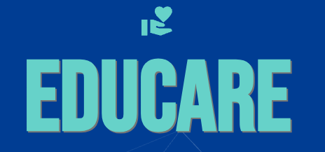
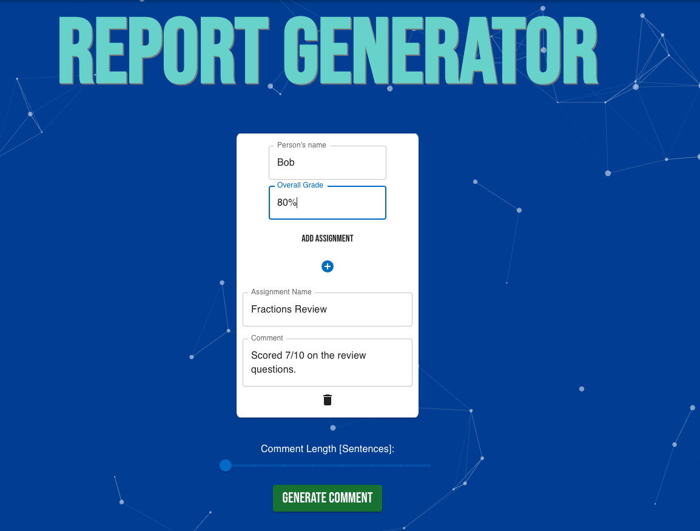
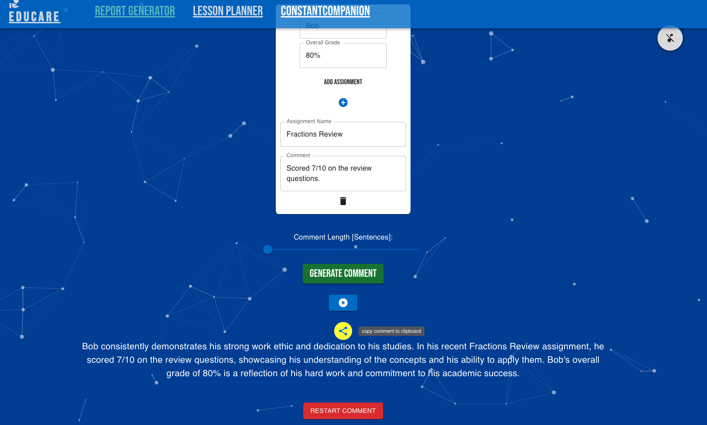
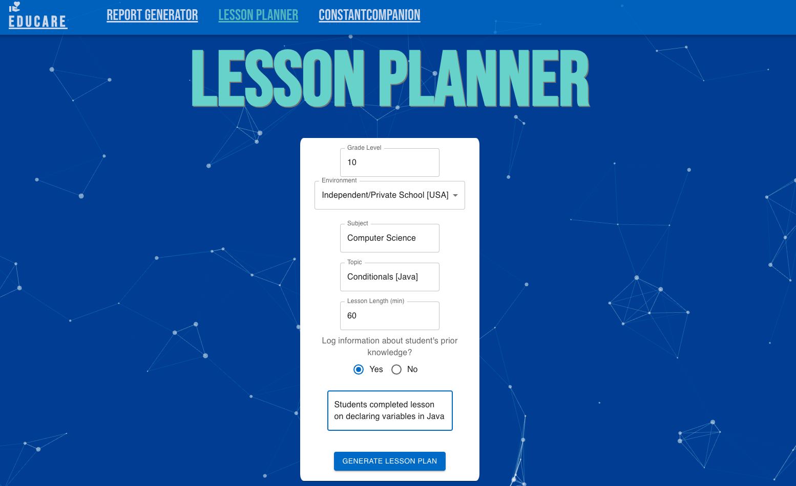
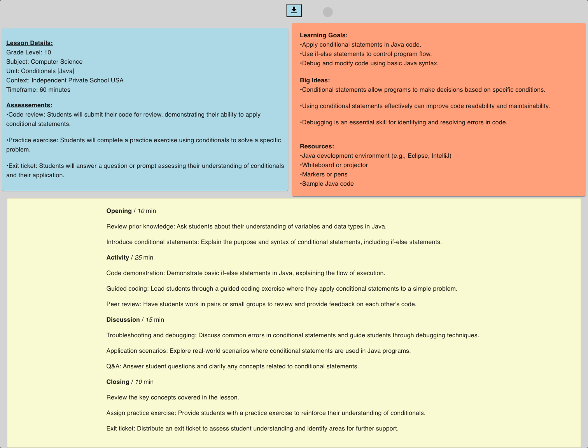
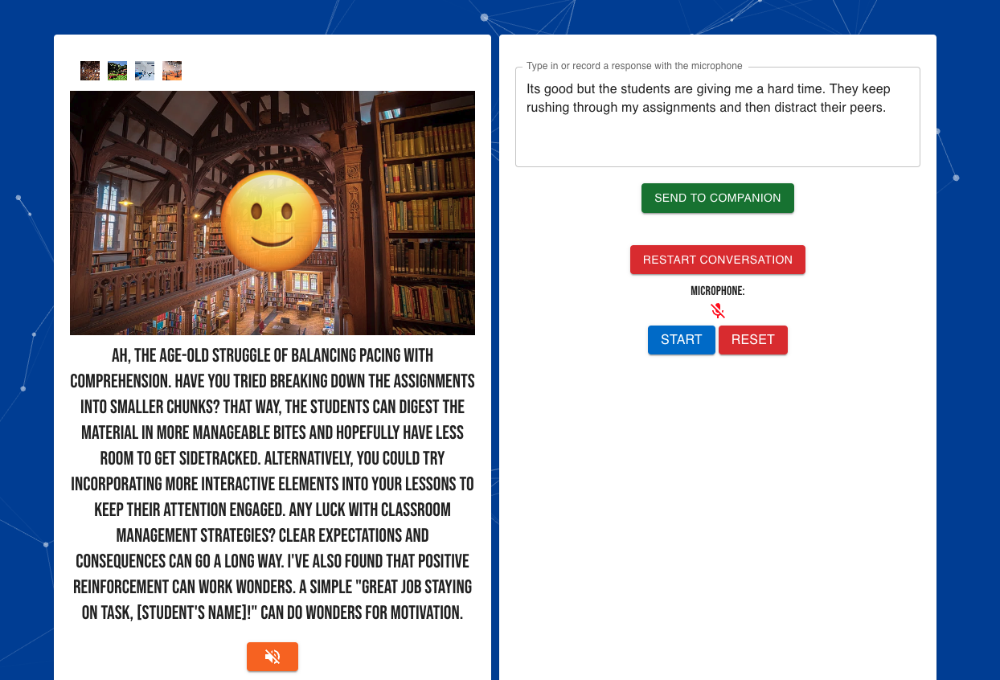

# <b>EduCare:</b> For All Your Teaching Needs 

## Summary
EduCare aims to alleviate some of the time constraints experienced throughout the school year through the use of AI-enhanced productivity. Specifically, by providing tools that streamline report writing, lesson planning, and the maintenance of individual well-being.

## App Problem Statement
Throughout the school year, numerous tasks consume a significant amount of time beyond classroom teaching. AI-based large language models (LLMs) offer a way to simplify, enhance, and standardize much of this non-teaching-related workflow. Additionally, in some instances, AI serves as a tool for brainstorming and fostering well-being through dialogue.

## EduCare? 
When the school year commences and you're teaching in the trenches, the responsibility falls on you to plan and be prepared. EduCare is an app that prioritizes the quality of your work (and teaching) by alleviating the burden of education-related tasks that are consistent across different environments.

Moreover, EduCare also offers a platform for conversing with an AI chatbot to help unpack some of the daily stress and brainstorm ideas for the classroom, much like a supportive colleague would.

<p align="center">

</p>


## EduCare App UX Features
- <ins>Report Generator:</ins> 
Enable the feature to generate reports or assessments for students based on an overall score. Optionally log assignments to provide additional context for the AI model. Utilize the slider to control the length of the comment. Enable the audio feature to have the comment read aloud for proofreading purposes.
<br></br>
<i>This view allows for entering the student's name and a grade. Additionally, details about an assignment have been included. The slider now controls the length of the output comment, with the length set to the minimum value.</i>
<p align="center">

</p>

<br></br>
<i>The following view displays the output comment generated by the AI. Users can click on the play button to have the comment read aloud for proofreading. The circular button enables users to copy and paste the output comment to the clipboard.</i>
<p width="90%" align="center">

</p>

<br></br>
- <ins>Lesson Planner:</ins> 
Input the necessary data and receive a comprehensive lesson plan complete with learning goals, big ideas, material list, and pacing guidelines. Optionally, provide details about students' prior knowledge or learning on a topic to offer context for the AI model to develop the lesson plan. Once the lesson plan is generated, you can download an image of the file.
<br></br>
<i>Below, I've provided details to generate a lesson plan for a 10th-grade computer science class. Additionally, I've included some additional information about the students' prior knowledge and the programming language taught.</i>
<p align="center">

</p>

<i>The output from the lesson planner is a complete lesson plan, encompassing learning goals (S.W.A.B.A.T.) as well as "Big Ideas" within the lesson itself. At the top of the page, the copy button enables users to save an image of the lesson plan:</i>
<br></br>
<p align="center">

</p>

- <ins>Constant Companion:</ins> 
Engage in a conversation with an AI chatbot primed to act as a supportive school colleague. Ask for advice on lesson planning or discuss some of the behavioral management challenges with students. The chatbot will be empathetic and ultimately provide guidance. Change the background behind the 'face' to enhance your comfort with your constant companion.

<i>When you arrive at the ConstantCompanion page, you can either type in a response or press the blue start button to initiate voice-to-text transcription.</i>

<p align="center">

</p>

<i>Here, I've asked the companion for advice on classroom management. The AI's response appears below the face. On desktop, the face will actually move and talk back! You can toggle the audio off at any time and continue recording yourself to respond to the companion, just like in a regular conversation.</i>
<p align="center">

</p>

## Tools and Frameworks used
- <strong>React.js</strong>:
The web app was built using this front-end framework.
- <strong>Google AI Studio/Google Gemini</strong>:
Google AI Studio enables you to iterate on different AI prompts to determine what works best. Once you have a prompt suitable for your desired use case, you can export it for integration into your code. The AI Studio leverages Google's Gemini AI (Large Language Model).
- <strong>Material UI</strong>:
The front-end styling library throughout the app.

## Running the App locally
To run the dApp locally, an Google AI Studio API key is needed. Follow [these instructions](https://aistudio.google.com/app/apikey) to create your own API key with Google. 

After cloning [this repository](https://github.com/kitfud/AI_ReportCardGenerator), create a `.env` file in the root folder. 

Copy and paste your created API token in the .env file with the variable names as follows;  <i>replace `<API_KEY>` with your own details</i>:

REACT_APP_GOOGLE_API=`<API_KEY>`

### Once the `.env` file is created:

CD into the folder, and run:
```
npm install
npm start
```

## Live Deployment
[coming soon]:

## Developer
- [@kitfud](https://github.com/kitfud)

# Music:
Music by: https://www.bensound.com
<br></br>
License code: VN01KA8MDLM1EZRQ